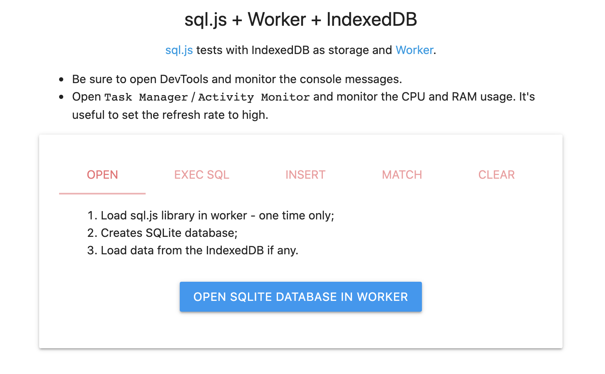

# sql-js-worker-test

[sql.js](https://github.com/sql-js/sql.js) tests with IndexedDB as storage and [Worker](https://developer.mozilla.org/en-US/docs/Web/API/Worker).

## Try it yourself

- Either open [https://yanli0303.github.io/sql-js-worker-test/](https://yanli0303.github.io/sql-js-worker-test/) with a browser;
- Or sideload [microsoft-outlook-add-in-manifest.xml](microsoft-outlook-add-in-manifest.xml) in Microsoft Outlook as an add-in.

1. First, on `OPEN` tab, click the `OPEN SQLITE DATABASE IN WORKER` to load `sql.js` library in Worker and initialize the SQLite database.
2. Then, on `EXEC SQL` tab,
   - Choose `CREATE TABLE` by clicking `SELECT SQL`;
   - Check the `Will the SQL write any data?`;
   - Click the `EXEC SQL` button.
3. Switch to `INSERT` tab, select the number of rows to insert, then click the `INSERT` button.
   > The page might freeze for a few seconds while it generates random strings and numbers to insert.
4. To verify the insertion, go back to `EXEC SQL` tab, choose `SELECT COUNT(*)` in `SELECT SQL` and click the `EXEC SQL` button to get the number of rows in the table.
5. Go to `MATCH` tab, enter random numbers or texts, hit either of the two match buttons.
